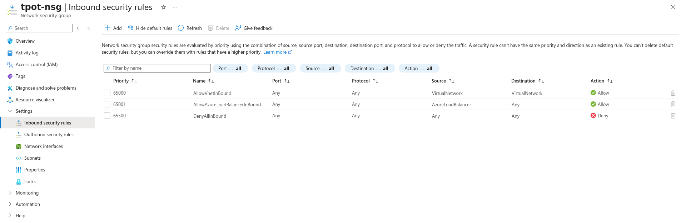
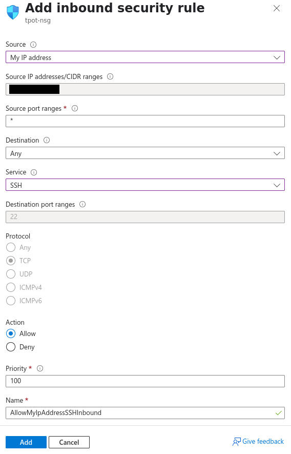
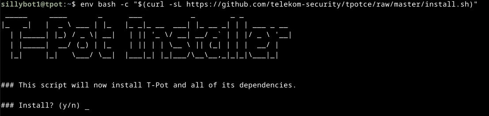
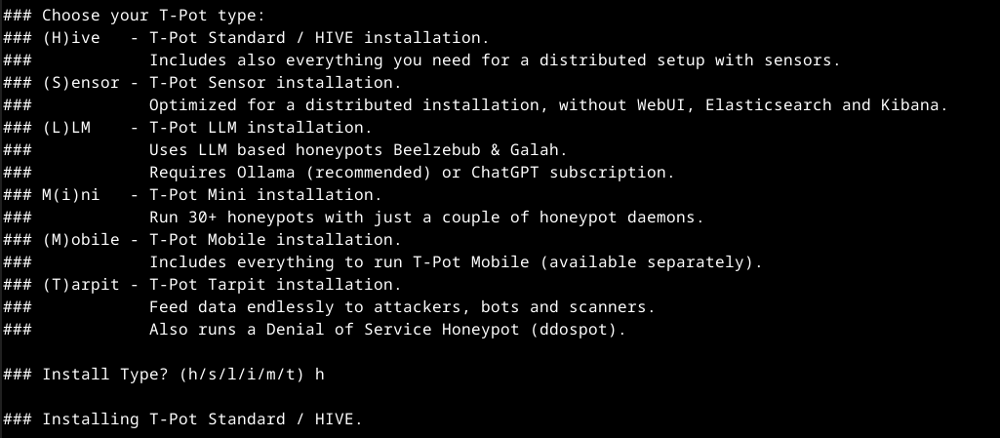
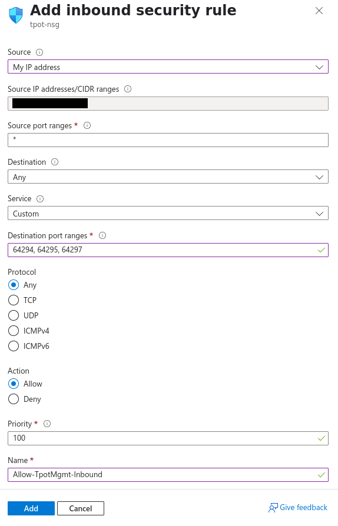
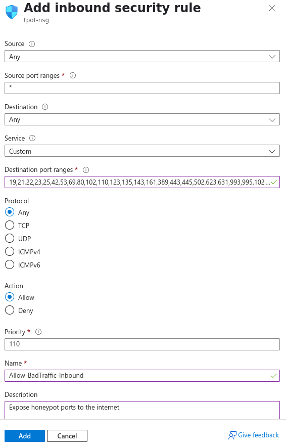
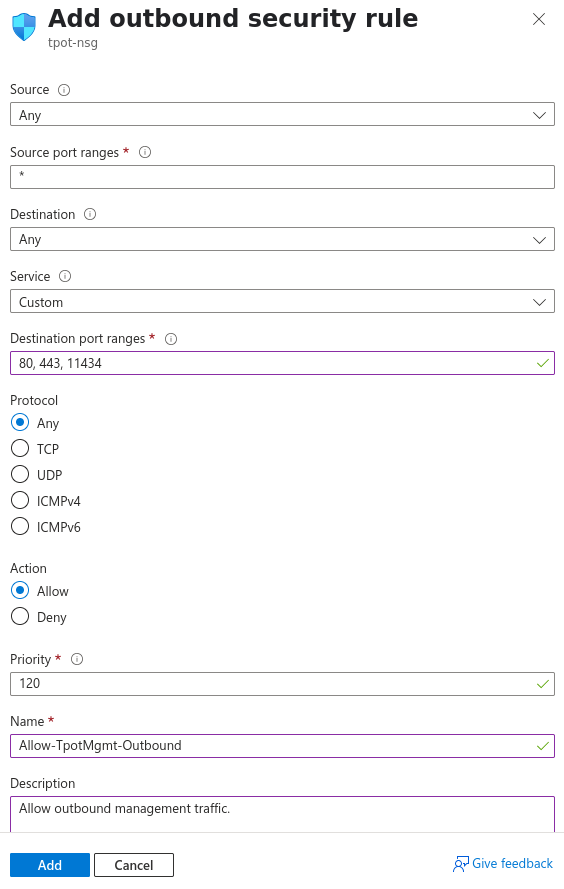
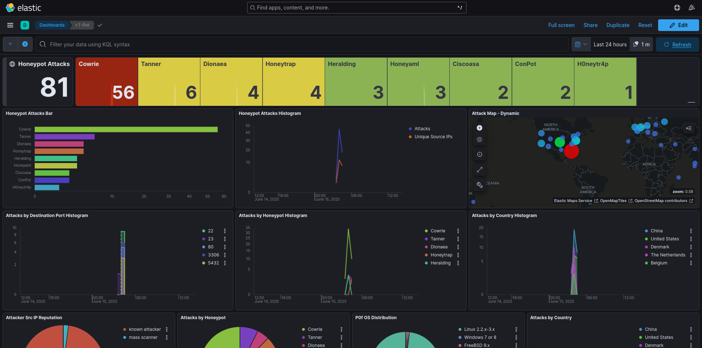

Hi, this is a simple guide for how you can setup Telekom's awesome multi-honeypot T-Pot on Azure!

 

## Azure VM Deployment

 

## Installing [T-Pot](https://github.com/telekom-security/tpotce)

1. Create temporary SSH firewall rule (VM > Side Panel > Networking > Settings > (+) Create Port Rule > Inbound)

3. SSH into the VM
4. Follow the [quick installation steps](https://github.com/telekom-security/tpotce#tldr) listed on the official repo

- <b>Side note:</b> If unattended-upgrades.service is running (check with `sudo systemctl status unattended-upgrades.service`), you may need to stop it temporarily to avoid 'dpkg frontend lock' errors: `sudo systemctl stop unattended-upgrades.service`

 

#### During install:
- T-Pot install type: 'h'

- Document your chosen web username/password. You will need this to login to the T-Pot Web Dashboard.
- Even though Azure NSG rules restrict access, make sure to have a strong web user password (e.g. 30+ char alhpa-numeric).

 

## System Tweaks

    $ nano /etc/ssh/sshd_config
    - change: PasswordAuthentication {} --> PasswordAuthentication no

    $ sudo apt install unattended-upgrades
    $ sudo systemctl enable --now unattended-upgrades.service
    
    $ sudo crontab -e
    # cleanup
    0 2 * * 0 apt autoremove --purge && apt autoclean -y
    
    $ sudo systemctl disable --now exim4-base.timer exim4-base.service exim4.service
    $ sudo apt purge exim4*    # wow this thing is annoying

 

## Create NSG Firewall Rules

#### Inbound:

    Source: My IP address
    Source IP addresses/CIDR ranges: {your public IP}
    Source port ranges: *
    Destination: Any
    Service: Custom
    Destination port ranges: 64294, 64295, 64297
    Protocol: Any
    Action: Allow
    Priority: 100
    Name: Allow-TpotMgmt-Inbound
    Description: Allow SSH and Web Dashboard access from My IP.

    Source: My IP address
    Source IP addresses/CIDR ranges: {your public IP}
    Source port ranges: *
    Destination: Any
    Service: Custom
    Destination port ranges: 19,21,22,23,25,42,53,69,80,102,110,123,135,143,161,389,443,445,502,623,631,993,995,1025,1080,1433,1521,1723,1883,1900,2404,2575,3000,3306,3389,5000,5060,5432,5555,5900,6379,6667,8080,8081,8090,8443,9100,9200,10001,11112,11211,25565,44818,47808,50100
    Protocol: Any
    Action: Allow
    Priority: 110
    Name: Allow-BadTraffic-Inbound
    Description: Expose honeypot ports to the internet.

#### Outbound:

    Source: Any
    Source port ranges: *
    Destination: Any
    Service: Custom
    Destination port ranges: 80, 443, 11434
    Protocol: Any
    Action: Allow
    Priority: 120
    Name: Allow-TpotMgmt-Outbound
    Description: Allow outbound management traffic.

 

## Test Access
- <b>Web Dashboard:</b> https://{Azure VM Public IP}:64297

  
- <b>SSH:</b> ssh {username}@{Azure VM Public IP} -p 64295

 

## Troubleshooting
#### If you choose to install T-Pot on a Debian 12 Azure VM, there are a few issues you may run into. Below are steps for troubleshooting:

- To check fot TPot-related errors:   `journalctl -u tpot -f`

 

- To check the status/errors of tpot.service:   `sudo systemctl status tpot.service`

 

- To check for port bind conflicts that will force-restart tpot.service:   `sudo netstat -tulpen` or `sudo ss -tunlap`

 

- You may need to manually configure DNS/nameservers in case of port 53 conflict between 
    
        $ nano /etc/resolve.conf
        127.0.0.1 {results of hostname}
        nameserver 8.8.8.8
        nameserver 8.8.4.4
