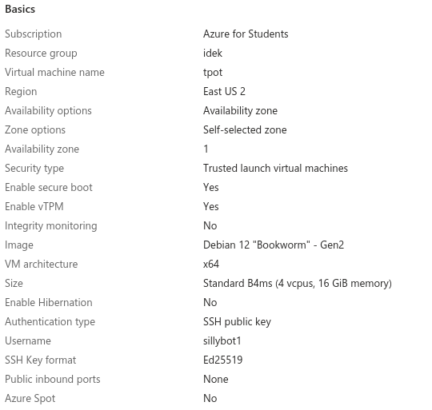
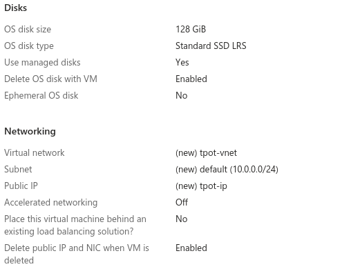

Hi, this is a simple guide for how you can setup Telekom's awesome multi-honeypot T-Pot on Azure!

 

## Azure VM Deployment

 

## Installing [T-Pot](https://github.com/telekom-security/tpotce)

1. Create temporary SSH firewall rule
2. SSH into VM
3. Follow the [quick installation steps](https://github.com/telekom-security/tpotce#tldr) listed on the official repo: 

 

#### During install:
- Install type: 'h'
- Make sure to have a strong web user password (e.g. 30+ char alhpa-numeric) as the web UI will be internet-facing!

 

## Bit of System Config

    $ nano /etc/ssh/sshd_config
    change: PasswordAuthentication no
    
    $ sudo apt update && sudo apt upgrade -y	
    $ sudo apt install unattended-upgrades
    $ sudo systemctl enable --now unattended-upgrades.service
    
    $ sudo crontab -e
    0 2 * * * apt autoremove --purge && apt autoclean -y

 

## Create NSG Firewall Rules

Outbound Management Ports (dest): 
80, 443, 11434

Inbound Management Ports: 
64294, 64295, 64297

Inbound Honeypot Ports:
19,21,22,23,25,42,53,69,80,102,110,123,135,143,161,389,443,445,502,623,631,993,995,1025,1080,1433,1521,1723,1883,1900,2404,2575,3000,3306,3389,5000,5060,5432,5555,5900,6379,6667,8080,8081,8090,8443,9100,9200,10001,11112,11211,25565,44818,47808,50100

 

## Test Access
- <b>Web Dashboard:</b> https://{Azure VM Public IP}:64297
- <b>SSH:</b> ssh {username}@{Azure VM Public IP} -p 64295
